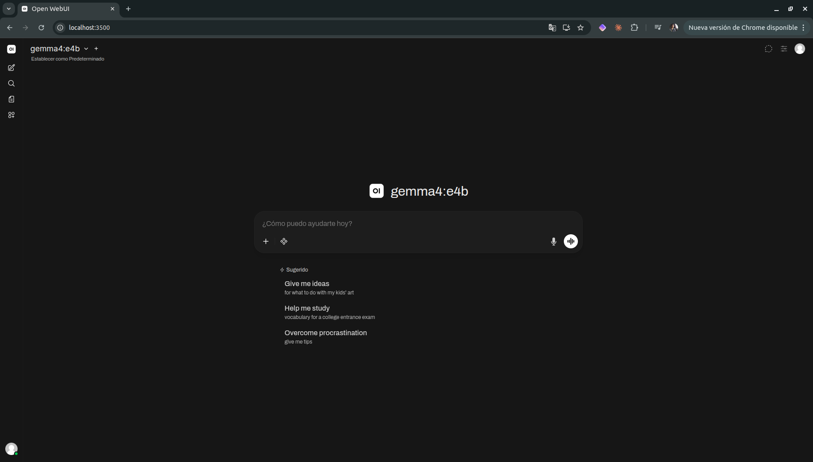

# Ramon IA — Stack de LLM Local

Stack Docker con **Ollama** + **Open WebUI** para correr modelos LLM localmente.

| Servicio | Puerto | Contenedor |
|----------|--------|------------|
| Ollama API | `11500` | `ramon-ollama` |
| Open WebUI | `3500` | `ramon-webui` |

---

## Setup inicial


1)  Crear .env y elegir el modelo (ver tabla abajo)
#    Por defecto ya viene configurado gemma3:4b
```bash
cp .env.example .env
```

2)  Levantar el stack — descarga el modelo automáticamente
```bash
docker compose up -d
```

3) Verificar que todo esté corriendo
```bash
docker compose ps
```

# 4. Abrir la interfaz web
#    → http://localhost:3500




El login está **desactivado** (uso personal local). Al abrir Open WebUI por primera vez no necesitás crear cuenta.

### Elegir modelo

Editá `MODEL` en `.env` antes de levantar el stack. El servicio `model-init` descarga el modelo automáticamente.

| Modelo | RAM necesaria | Parámetros reales | Velocidad CPU | Cuándo usarlo |
|--------|--------------|-------------------|---------------|---------------|
| `gemma3:4b` | ~3 GB | 4B | ~8-12 t/s | Máquinas con 8-16 GB RAM |
| `gemma4:e4b` | ~10 GB | 8B (efectivos 4B) | ~3-6 t/s | Máquinas con 16+ GB RAM libres |

> **Nota sobre `gemma4:e4b`**: el nombre es engañoso — arquitectónicamente son 8B parámetros con cuantización Q4_K_M. Requiere ~10 GB de RAM libre. En un sistema con 16 GB físicos, el SO y otros procesos consumen ~5-6 GB, lo que puede dejarte sin margen. En una PC con 32 GB funciona sin problema.

---

## Comandos del día a día

```bash
# Levantar el stack
docker compose up -d

# Apagar el stack
docker compose down

# Ver logs en tiempo real
docker compose logs -f

# Ver logs de un servicio específico
docker compose logs -f ollama
docker compose logs -f webui

# Ver estado de los contenedores
docker compose ps

# Verificar que todo está OK
bash scripts/healthcheck.sh
```

---

## Probar desde terminal

```bash
# Listar modelos disponibles
curl http://localhost:11500/api/tags

# Generar texto (sin streaming)
curl http://localhost:11500/api/generate -d '{
  "model": "gemma4:e4b",
  "prompt": "¿Qué es Docker?",
  "stream": false
}'

# Generar texto (con streaming)
curl http://localhost:11500/api/generate -d '{
  "model": "gemma4:e4b",
  "prompt": "¿Qué es Docker?"
}'

# Chat (API compatible con OpenAI)
curl http://localhost:11500/v1/chat/completions \
  -H "Content-Type: application/json" \
  -d '{
    "model": "gemma4:e4b",
    "messages": [{"role": "user", "content": "Hola, ¿cómo estás?"}]
  }'
```

---

## Gestionar modelos

```bash
# Ver modelos instalados
docker exec ramon-ollama ollama list

# Descargar un modelo
docker exec ramon-ollama ollama pull gemma4:e4b

# Eliminar un modelo
docker exec ramon-ollama ollama rm gemma4:e4b

# Ver modelos que están cargados en RAM ahora
docker exec ramon-ollama ollama ps

# Ejecutar modelo en modo interactivo (terminal)
docker exec -it ramon-ollama ollama run gemma4:e4b
```

---

## Configurar Cline en VSCode

Cline es una extensión de VSCode para usar IA como agente de código. Para apuntarlo a este stack:

1. Abrí VSCode → extensión **Cline** → ícono de configuración (engranaje)
2. En **API Provider** seleccioná: `Ollama`
3. Completá los campos:
   - **Base URL**: `http://localhost:11500`
   - **Model**: `gemma4:e4b`
4. Guardá y probá con cualquier prompt

> **Alternativa con provider OpenAI-compatible:**
> - **API Provider**: `OpenAI Compatible`
> - **Base URL**: `http://localhost:11500/v1`
> - **API Key**: `ollama` (cualquier string, no se valida)
> - **Model**: `gemma4:e4b`

---

## Cambiar modelo o puertos

Todo se controla desde `.env`:

```bash
# Cambiar modelo (model-init lo descarga automáticamente al levantar)
MODEL=gemma4:e4b

# Cambiar puertos
OLLAMA_PORT=12000
WEBUI_PORT=4000
```

```bash
# Aplicar cualquier cambio del .env
docker compose down
docker compose up -d
```

---

## Seguridad y acceso a la red

### Por qué el stack solo escucha en localhost por default

Con `BIND_ADDRESS=127.0.0.1`, los puertos `11500` y `3500` solo son accesibles desde **esta máquina**. Si estás en un café, coworking, aeropuerto o cualquier red que no controlás, nadie más puede conectarse — aunque conozcan tu IP o escaneen puertos.

Verificá que está bien configurado:

```bash
ss -tlnp | grep -E '3500|11500'
# Tiene que mostrar 127.0.0.1:3500 y 127.0.0.1:11500
# Si ves 0.0.0.0 cuando no querías, revisá BIND_ADDRESS en .env
```

### Cuándo tiene sentido cambiar a `0.0.0.0`

- Querés acceder al modelo desde otra notebook en tu casa
- Querés usarlo desde el celular en la misma red Wi-Fi
- Lo compartís con compañeros en una LAN de confianza

### Cómo cambiarlo

```bash
# En .env:
BIND_ADDRESS=0.0.0.0

# Opcional pero recomendado si exponés a la red:
# En docker-compose.yml, sección webui > environment:
#   - WEBUI_AUTH=True

# Aplicar:
docker compose down && docker compose up -d
```

### Advertencias

- **No expongas el stack a internet directamente.** No hagas port forwarding en tu router apuntando a estos puertos.
- **No uses `0.0.0.0` en redes públicas.** En una red que no controlás, cualquier persona podría usar tu modelo y leer el historial de chats de Open WebUI.
- **Si exponés a la red, activá autenticación.** Cambiá `WEBUI_AUTH=False` a `WEBUI_AUTH=True` en `docker-compose.yml` para que Open WebUI requiera login.
- La API de Ollama (`11500`) no tiene autenticación propia — si la exponés, cualquiera puede llamarla directamente.

---

## Troubleshooting

### El contenedor no levanta
```bash
docker compose logs ollama
docker compose logs webui
```

### Open WebUI no conecta con Ollama
```bash
# Verificar que Ollama está respondiendo internamente
docker exec ramon-webui curl -s http://ramon-ollama:11434/api/tags
```

### El modelo responde muy lento
Es normal en CPU-only. El modelo `gemma4:e4b` (4B parámetros) en un Ryzen 5 7520u genera aproximadamente 3-8 tokens/segundo. Para respuestas más rápidas, usá prompts más cortos o un modelo más chico (ej: `gemma3:2b`).

### Puerto ya en uso
```bash
# Ver qué usa el puerto
ss -tlnp | grep 11500
ss -tlnp | grep 3500
```

### Ver consumo de recursos
```bash
docker stats ramon-ollama ramon-webui
```

---

## Resetear todo

```bash
# Apagar y eliminar contenedores + red (los volúmenes persisten)
docker compose down

# Apagar y eliminar TODO incluyendo volúmenes (borra modelos y chats)
docker compose down -v

# Eliminar imágenes también
docker compose down -v --rmi all
```

---

## Estructura del proyecto

```
Ramon/
├── docker-compose.yml     # Definición del stack
├── .env                   # Variables de entorno (no versionar)
├── .env.example           # Plantilla de variables (versionar)
├── .gitignore
├── README.md
└── scripts/
    └── healthcheck.sh     # Valida que el stack esté OK
```
